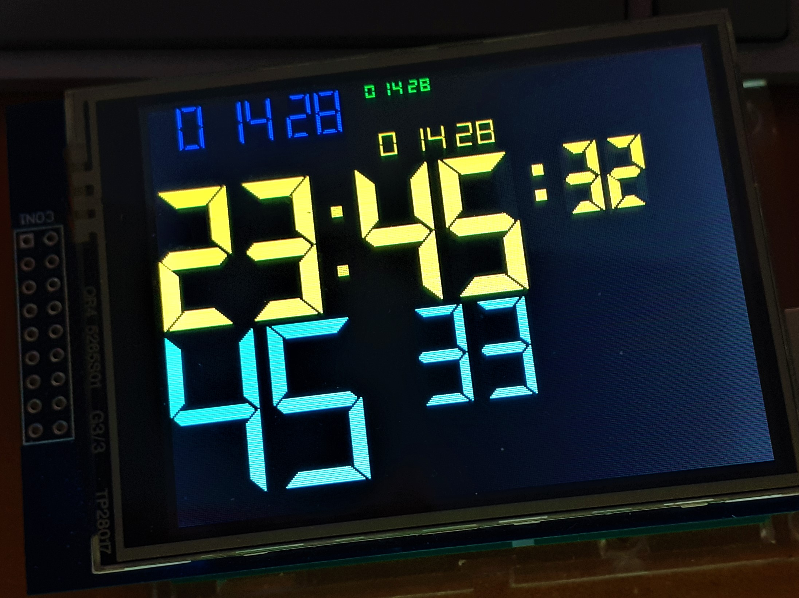

# TFT LCD Virtual Segment Display for Arduino

TFT LCD Virtual Segment Display Library for Arduino 

Project blogs on element14.com:

[Arduino UNO TFT LCD Virtual Clock Display Library](https://community.element14.com/challenges-projects/project14/buildapresent/b/blog/posts/arduino-uno-chess-clock-_2d00_-tft-lcd-virtual-clock-display-library)

[Arduino UNO TFT LCD Chess Clock with full time controls element14 Blog](https://community.element14.com/challenges-projects/project14/buildapresent/b/blog/posts/arduino-uno-tft-lcd-touch-digital-chess-clock)

This library allows to display different virtual segment displays on a TFT LCD using Adafruit TFTLCD Library https://github.com/adafruit/TFTLCD-Library

# Projects using this library

[Arduino TFT Chess Clock](https://github.com/javagoza/ArduinoTFTChessClock)
